# Dataset Overview


## `224` building_31_stairs_v1
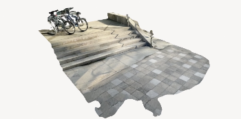

```shell
building_31_stairs_v1
```

## `160` curb_gas_tank_v1

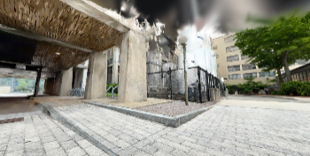

```shell
curb_gas_tank_v1
```


## `224` gaps_stata_v1

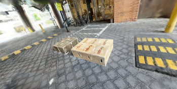

```shell
gaps_stata_v1
```

## `192` gaps_12in_226_blue_carpet_v2
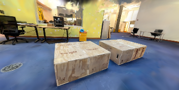

```shell
gaps_12in_226_blue_carpet_v2
```

## `192` gaps_16in_226_blue_carpet_v2
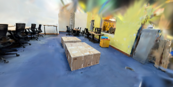

```shell
stairs_36_backstairs_v2
```

## `224` stairs_36_backstairs_v2
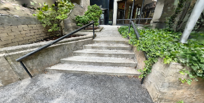

```shell
stairs_36_backstairs_v2
```

## `192` gaps_fire_outlet_v3


```shell
gaps_fire_outlet_v3
```

## `224` gaps_grassy_courtyard_v2
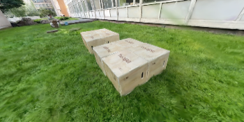

```shell
gaps_grassy_courtyard_v2
```

## ` 96` hurdle_stata_v1
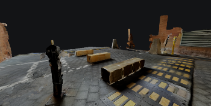

```shell
hurdle_stata_v1
```

## `224` hurdle_226_blue_carpet_v3
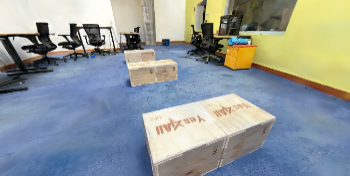

```shell
hurdle_226_blue_carpet_v3
```

## `192` hurdle_226_blue_carpet_v3


```shell
hurdle_226_blue_carpet_v3
```
copy
## `192` hurdle_black_stone_v1
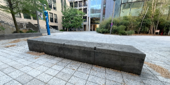

```shell
hurdle_black_stone_v1
```

## `224` hurdle_one_blue_carpet_v2
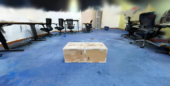

```shell
hurdle_one_blue_carpet_v2
```

## `224` hurdle_one_dark_grassy_courtyard_v1


```shell
hurdle_one_dark_grassy_courtyard_v1
```

## `224` hurdle_one_light_grassy_courtyard_v1
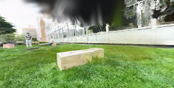

```shell
hurdle_one_light_grassy_courtyard_v1
```

## `288` hurdle_one_light_grassy_courtyard_v3
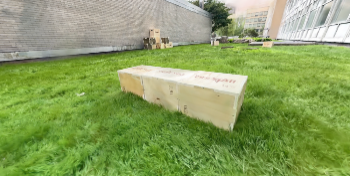

```shell
hurdle_one_light_grassy_courtyard_v3
```

## `224` hurdle_stata_one_v1
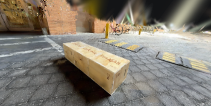

```shell
hurdle_stata_one_v1
```

## ` 96` hurdle_stata_v1


```shell
hurdle_stata_v1
```

## `192` hurdle_stata_v2
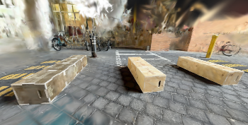

```shell
hurdle_stata_v2
```

## `288` hurdle_three_grassy_courtyard_v2
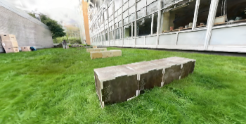

```shell
hurdle_three_grassy_courtyard_v2
```

## `160` ramp_aligned_blue_carpet_v4
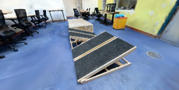

```shell
ramp_aligned_blue_carpet_v4
```

## `160` ramp_aligned_covered_blue_carpet_v6
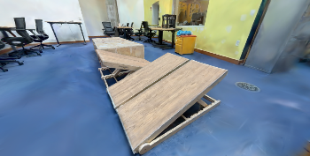

```shell
ramp_aligned_covered_blue_carpet_v6
```

## `160` ramp_bricks_v2
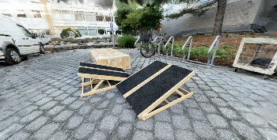

```shell
ramp_bricks_v2
```

## `160` ramp_grass_v1
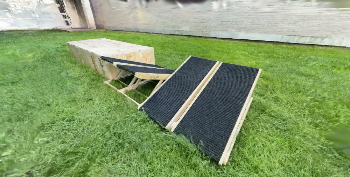

```shell
ramp_grass_v1
```

## `160` ramp_grass_v3
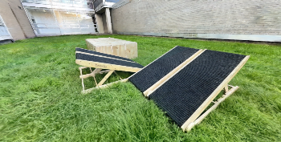

```shell
ramp_grass_v3
```

## `192` ramp_open_1


```shell
ramp_open_1
```

## `160` ramp_spread_blue_carpet_v5
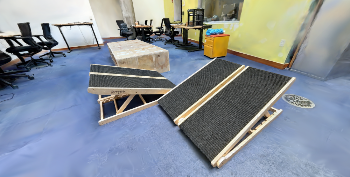

```shell
ramp_spread_blue_carpet_v5
```

## `160` ramp_spread_covered_blue_carpet_v7


```shell
stairs_36_backstairs_v2
```

## `160` real_curb_01


```shell
stairs_36_backstairs_v2
```

## `160` real_curb_02


```shell
stairs_36_backstairs_v2
```

## `288` real_flat_01_stata_grass


```shell
stairs_36_backstairs_v2
```

## `256` real_flat_02_wh_evening


```shell
stairs_36_backstairs_v2
```

## `224` real_flat_03_stata_indoor


```shell
stairs_36_backstairs_v2
```

## `160` real_gap_01


```shell
stairs_36_backstairs_v2
```

## `160` real_gap_02


```shell
stairs_36_backstairs_v2
```

## `160` real_hurdle_01


```shell
stairs_36_backstairs_v2
```

## `160` real_hurdle_one_blue_carpet_v2


```shell
stairs_36_backstairs_v2
```

## `128` real_hurdle_one_stata_blue_lab_carpet_v1


```shell
stairs_36_backstairs_v2
```

## `160` real_hurdle_stata_ally_v1


```shell
stairs_36_backstairs_v2
```

## `192` real_hurdle_three_grassy_ally_v2


```shell
stairs_36_backstairs_v2
```

## `224` real_parkour_01


```shell
stairs_36_backstairs_v2
```

## `192` real_stair_01


```shell
stairs_36_backstairs_v2
```

## `224` real_stair_02_bcs_v1


```shell
stairs_36_backstairs_v2
```

## `224` real_stair_03_bcs_golden


```shell
stairs_36_backstairs_v2
```

## `192` real_stair_04_bcs_dusk


```shell
stairs_36_backstairs_v2
```

## `192` real_stair_05_bcs_rain_v1


```shell
stairs_36_backstairs_v2
```

## `192` real_stair_06_wh_evening_v1


```shell
stairs_36_backstairs_v2
```

## `192` real_stair_07_54_v1


```shell
stairs_36_backstairs_v2
```

## `192` real_stair_08_cs_afternoon_v1


```shell
stairs_36_backstairs_v2
```

## `224` real_stair_08_mc_afternoon_v1


```shell
stairs_36_backstairs_v2
```

## `288` real_stair_10_wh_afternoon_v1


```shell
stairs_36_backstairs_v2
```


## `160` stairs_36_backstairs_v2


```shell
stairs_36_backstairs_v2
```

## `224` stairs_48_v3


```shell
stairs_36_backstairs_v2
```

## `192` stairs_4_stairs2up_v1


```shell
stairs_36_backstairs_v2
```

## `160` stairs_54_wooden_v1


```shell
stairs_36_backstairs_v2
```

## `192` stairs_backstairs_v5


```shell
stairs_36_backstairs_v2
```

## `224` stairs_banana_v1


```shell
stairs_36_backstairs_v2
```

## `160` stairs_cf_night_v13


```shell
stairs_36_backstairs_v2
```

## `160` stairs_mc_afternoon_v2


```shell
stairs_36_backstairs_v2
```

## `224` stairs_wh_evening_v2


```shell
stairs_36_backstairs_v2
```

## `128` stata_ramped_platform_v3


```shell
stairs_36_backstairs_v2
```

## `192` wood_ramp_aligned_bricks_v1


```shell
stairs_36_backstairs_v2
```

## `192` wood_ramp_aligned_grass_v2


```shell
stairs_36_backstairs_v2
```

## `192` wood_ramp_offset_bricks_v2


```shell
stairs_36_backstairs_v2
```

## `192` wood_ramp_offset_grass_v1


```shell
stairs_36_backstairs_v2
```
