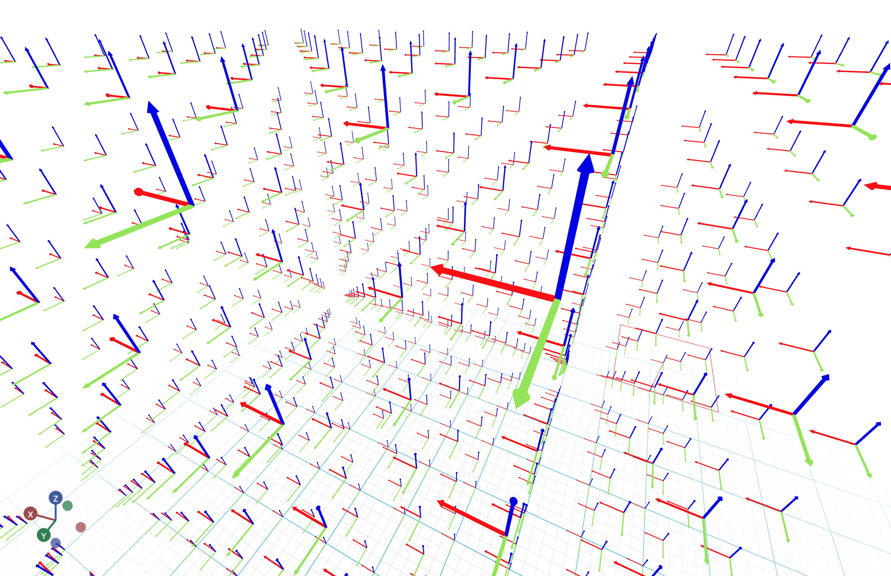

# Coordinates Markers

This example visualizes a large number of coordinates markers.



Live demo: TBD

```python
from asyncio import sleep

from neverwhere import neverwhere, neverwhereSession
from neverwhere.schemas import DefaultScene, CoordsMarker

app = neverwhere()

n = 10
N = 1000

markers = [
    CoordsMarker(
        position=[i % n, (i // n) % n, (i // n ** 2) % n],
        scale=0.25,
    )
    for i in range(N)
]


@app.spawn(start=True)
async def main(proxy: neverwhereSession):
    proxy.set @ DefaultScene(*markers)

    i = 0
    while True:
        i += 1
        await sleep(16)
```
