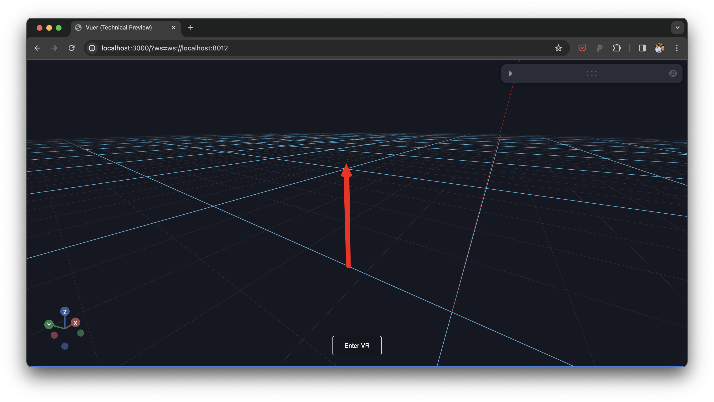

# Arrows

This example visualizes a large number of coordinates markers.




```python
from asyncio import sleep

from neverwhere import neverwhere, neverwhereSession
from neverwhere.schemas import DefaultScene, Arrow

app = neverwhere()

n = 10
N = 1000

arrow = Arrow(
    position=[0, 0.25, 0],
    rotation=[0, - 0.5 * 3.14, 0],
    scale=0.25,
)

@app.spawn(start=True)
async def main(proxy: neverwhereSession):
    proxy.set @ DefaultScene(arrow)

    # keep the main session alive.
    while True:
        await sleep(16)
```
